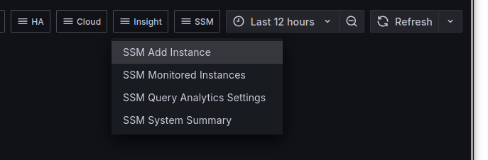
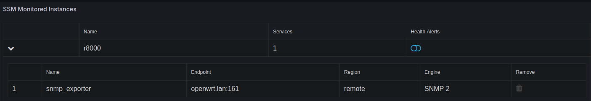

# Alerting

SSM has a feature to create default alerts with default thresholds.

To use this automatic alert creation feature, go to "SSM" -> "SSM Monitored Instances" in the menu:

and toggle the blue Health Alerts switch:

You may need to adjust thresholds for some alerts to suit your system or remove them entirely, e.g. replication lag is not useful on a master node.
