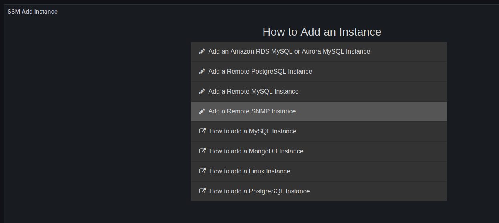
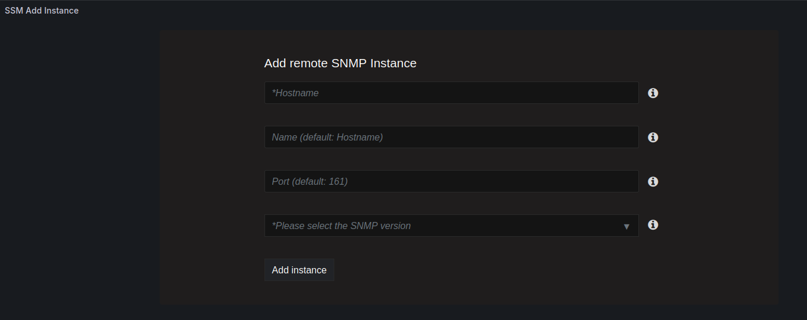
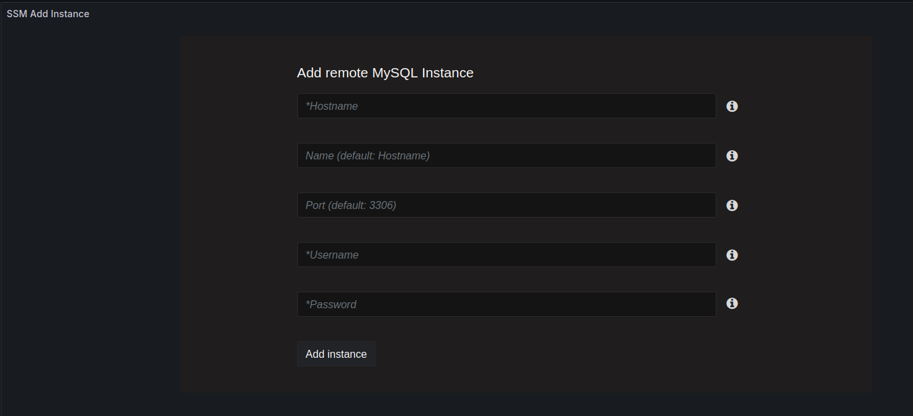
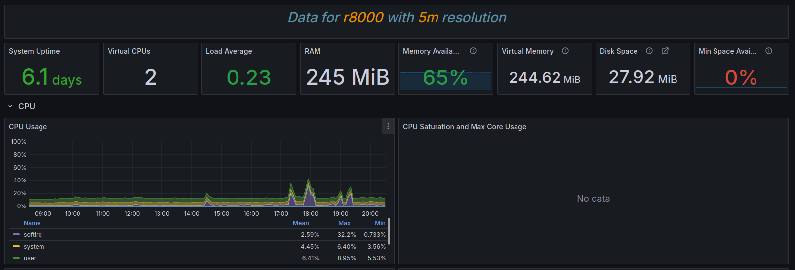

# Adding SNMP monitoring for remote hosts

If you are running a MySQL server on Windows, it is possible to monitor these as remote database servers with low level telemetry present using SNMP, which provides low level OS metrics. Without SNMP, we only get database telemetry.

Meanwhile with SNMP, we effectively do away with most of the need for having a dedicated Windows ssm-client package.

If you give the monitored server the same name for both the remote monitored database node and the remote monitored SNMP node, the metrics will be combined as the same server.

The SNMP metrics are significantly more limited than the ones provided by node_exporter running on the monitored node, but it is is a vast improvement over having no low level telemetry at all.

## How to add

Go to SSM Add Instance under the SSM menu:

Add the SNMP instance in "Add remote SNMP Instance":

Add the remote database instance with the same name in "Add remote MySQL Instance":

The SNMP instance should appear in the "Monitored Instances" dashboard like this:

An example of some telemetry being available in the "System Overview" dashboard:

## Configuration on Windows

Configuring SNMP on Windows is out of scope of SSM documentation, but it is reasonably simple (little more than enabling the service on Windows) and there are plenty of good HOWTOs online describing how to do it.
